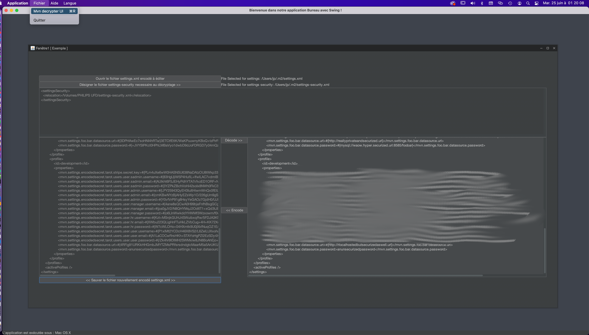

I did some tooling to facilitate the work, available here :
https://github.com/robert35/mvncypherutilities/tree/main

(sample app, a maven plugin(pojo), a gui to open / encode/ decode / update / encode / save the settings.xml

1-edit the settings.xml (a sample is given in the project) and put the encrypted variable like ("#{...} pattern"):

    ...<profiles>
        <profile>
            <id>production</id>
            <activation>
                <!-- do not use activeByDefault option, if a profile is set on the command line, and
                it will, the profile activated by default is skipped, prefer this way-->
                <property>
                    <name>!foobarenvironment</name>
                </property>
            </activation>
            <properties>
                                <mvn.settings.profile.production.foo.bar.datasource.url>#{3DPHAwEc7soHNI4hRTa/j3ETCtfEtlK/WaKPuuwnyKBoQ+tzPirR0Okhy9QEUTgWnwl4clMkO3Iv/j29HAM+WA==}</mvn.settings.profile.production.foo.bar.datasource.url>
            ...</properties>...

2-get the variable value from the pom using the pojo plugin dependency wich decode the variable at PROCESS_SOURCES phase by default

    <build>
        <plugins>
            <plugin>
                <groupId>com.epsilon777.mvncypherutilities</groupId>
                <artifactId>mvndecrypt</artifactId>
                <version>0.0.1-SNAPSHOT</version>
                <executions>
                    <execution>
                        <goals>
                            <goal>decrypt-properties</goal>
                        </goals>
                    </execution>
                </executions>
            </plugin>

3-and in your pom :

            ...<properties>
                <pom.foo.bar.datasource.url>${mvn.settings.profile.production.foo.bar.datasource.url}</pom.foo.bar.datasource.url>

-4 now the decoded value is available by maven for example in the property file in the ressource folder :

prop.foo.bar.datasource.url=@pom.foo.bar.datasource.url@

but unfortunately if someone has access to the jar those variables will be accessible unless you put them on the command line...

(furthermore you can relocate your settings-security.xml to use the relocation option to redirect to a usb volume...)

You will also have acces to a GUI editor to encrypt all the file in one time (by hand each password encryption is tedious and you don't remember what it refernces...)

